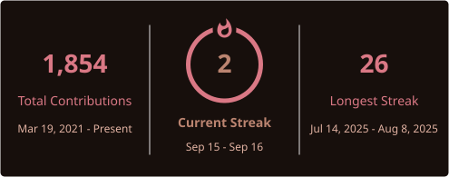

<!-- Your title -->
#   

### I'm [Manavjit Singh](https://drive.usercontent.google.com/download?id=1bdyiyG8M0xuZ0LCSSzKWT0RsV6vSNAb_&export=download), a Developer 🚀 from India

---

### 👨‍💻 About Me
I’m a **Computer Science student** who enjoys building things that actually work and solving problems that make me think.

I spend most of my time:
- Building **web applications** and experimenting with backend logic  
- Sharpening my **problem-solving & DSA fundamentals**  
- Learning how [backend engineering works from first principles](https://www.youtube.com/playlist?list=PLui3EUkuMTPgZcV0QhQrOcwMPcBCcd_Q1)
- Slowly preparing to explore **Web3 (Solana)**

I like progress over perfection, and I learn best by building.

---

### 📬 Find me at

---

### 🛠️ Languages & Tools

---

### 📊 GitHub Stats

  
  
  

---

---

### ✨ Motto
> *Still learning. Still building. Still improving.*
